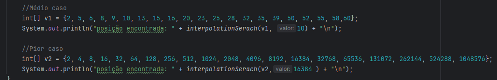
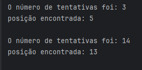

1 - o código se encontra em src/main/java/org.example

  

2 - Seguinda a suas notações Big O, o interpolation search será quase sempre mais rápido que o binary search, mas há um caso onde isso não ocorre, que é quando a lista não está com intervalos uniformes, por exemplo, em uma lista exponencial. Neste caso o interpolation search ocorre quase que um O(n). Com isso, o interpolation search será melhor de se utilizar quando sabe-se que os intervalos entre os números estejam uniformes.
